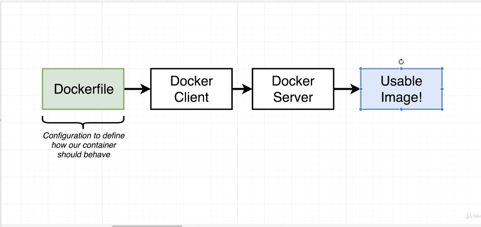
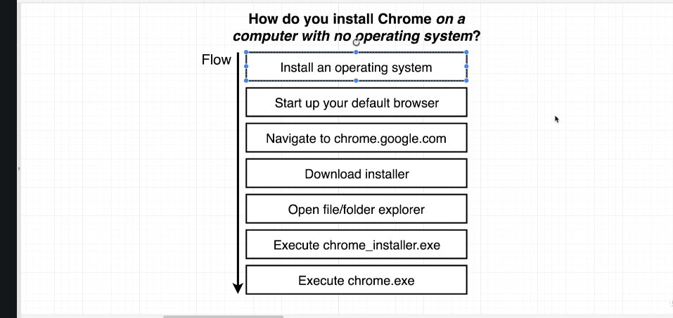
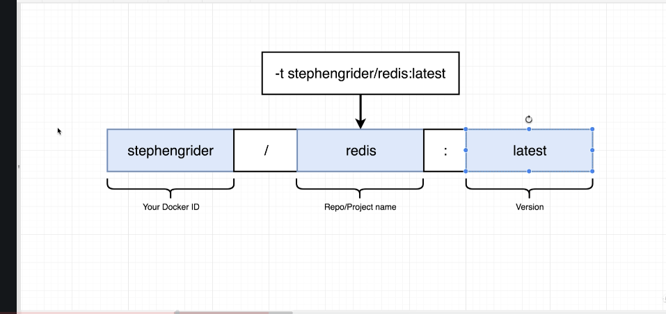
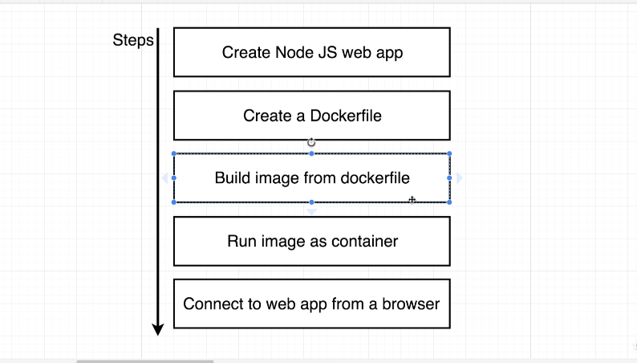
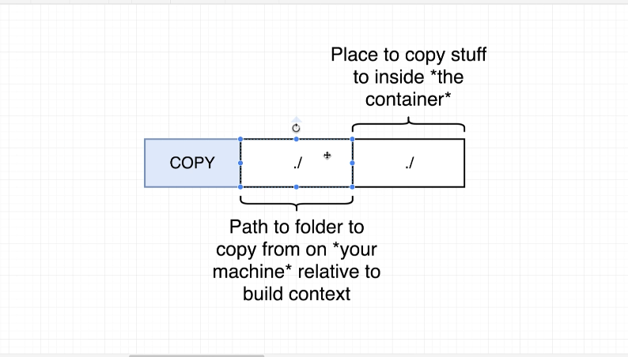
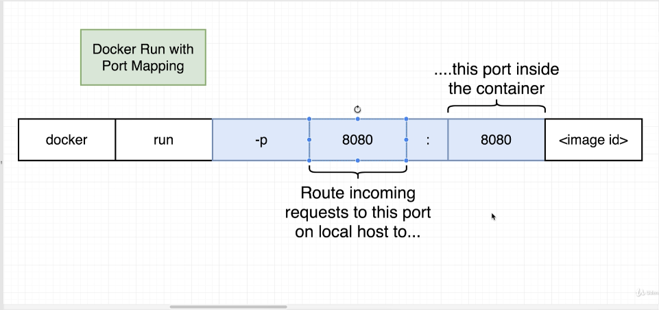
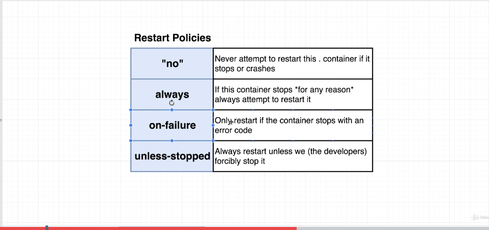

#Docker

###Basics:
- Image is the file system, including the executables and execution commands.
- Container is the environment of the image executed, partitioned on the general docker VM.
####Basic Commands:
- Run: starts the container and if do not exists checks the Docker Hub (repo of Docker) and downloads it from there
 and starts.
- Start: If the image is in your local, executes the container and takes a call back, if that call back execution
  exists in the image it self. If called with -a that stands for 'attach', logs the out put automatically.
- Create: Creates a docker container from an image, does not start it.
- Logs: Logs out all the outputs made from that container up until that point.  
- Stop: Send a Terminate signal to the container to shut down.  Does clean up 
  - If the stop Terminate signal is not executed with in 10 seconds, automatically docker will send a Kill signal.
- Kill: Sends a Kill signal does not do additional work for cleanup, shuts down immediately.  
- PS: Shows the running containers in the process.
- --interactive --tty ('-it') these are flags to use with exec command.
  - Interactive starts an stdin
  - TTY chains a teletypewriter to it   
  so that we can reach the terminal of the executed file.
- The call back of any Start or Run process can be 'sh' command that stands for **shell** that would start a shell in
 the container that you can run commands on.  

###Creating A Docker File:

####Creating An Image:

#### Creating an Image Anology:

#### Rubilds Caching
- Docker caches the build a cash from the latest build, as long as you do not change the order of the docker commands
 in your docker file, it would run the build from its cache and that makes docker very performant.
#### Naming Convention of Builds

- community images do not follow this convention.  
#####Image Tagging
``docker build -t armangurkan/redis:latest . //-t for tag and "." for path``

#####How to Create an Image Manually instead of Using A Dockerfile:
######Example: Manually Creating the Redis Image in the terminal
1. ``docker run -it alpine sh //docker istance is ran for alpine``
2. ``apk add --update redis //inside alpine shell command to download redis``
3. manually exit from alpine execution.
4. get the id of the alpine container by ``docker ps``
5. ``docker commit -c 'CMD ["redis-server"]' {#IdofAlpineContainer} //-c flag is for default command and after the
 flag the command is defined``
6. get the id of the new redis-server docker id ``docker run -it <#IdofRedisDocker>``  
This example shows the same functionality of dockerfile of this:  
```
/*Dockerfile*/
FROM alpine  
RUN apk add --update redis
CMD ['redis-server']
```

####Creating Containers from Your Own Projects  


_**First ./ is for the current directory PATH, the second ./ is the container PATH**_
1. Express mini project created under [simpleweb](./simpleweb).  
2. Dockerfile created.  
    ```
    FROM node:alpine
    WORKDIR /usr/app
    COPY ./package.json ./
    RUN npm install
    COPY ./ ./
    CMD ["npm", "start"] #make sure to use double quotes
    ```
3. ``Docker build .`` the image is built
4. ``Docker build -t armangurkan/simpleweb .`` latest is appended if not entered. rebuild
5. ``Docker run armangurkan/simpleweb``
6. Port mapping is made within the run command
    
    ``docker run -p 8080:8080 armangurkan/simpleweb //two ports do not have to be identical``

###Running Multiple Docker Containers  
####Docker Compose Commands
- `docker-compose up -d` d flag is for detach.
- `docker-compose down` stops all the running containers.
- Also docker-compose.yml file should be constructed, pls [visit docker-compose.yml](visits/docker-compose.yml)
####Docker docker-compose.yml Configuration:
- Server names, ports, images, if no images build paths, and restart policies etc. can be defined.
#####Restart Policies:

#####Container Status Check:
- `docker-compose ps` same thing as `docker ps`
    - major difference is `docker-compose ps` has to be ran on the same directory as the docker-compose.yml file
    , `docker ps` does not.
###Deploying to Production
It actually requires a workflow as a best practice:

####Setting Up Dockerfiles:
- We should have two Dockerfiles, one for development and one for production.
    - Dockerfile.dev  
        ````
      FROM node:alpine
      WORKDIR '/app'
      COPY ./package.json ./
      RUN npm install
      COPY ./ ./
      CMD ["npm", "run", "start"]
      ````
      - To run this command and specify that our dev environment Dockerfile is Dockerfile.dev we run this following
       command:
       ``docker build -f Dockerfile.dev .``
       - You have to delete your node modules directory in the local environment because those dependencies will be
        placed in the docker container where you are going to test your code.

    - Dockerfile

####HotStartReload on Docker Containers
- After `Docker run` command we bind the local files to the container with `-v` flag and create references to the
 directories in the container to the directories in the local machine.  `-v` flag stands for Docker Volumes. 
  - Docker volumes are kind of file system entities that mirror local files.
