# Docker

### Basics:
- Image is the file system, including the executables and execution commands.
- Container is the environment of the image executed, partitioned on the general docker VM.
#### Basic Commands:
- Run: starts the container and if do not exists checks the Docker Hub (repo of Docker) and downloads it from there
 and starts.
- Start: If the image is in your local, executes the container and takes a call back, if that call back execution
  exists in the image it self. If called with -a that stands for 'attach', logs the out put automatically.
- Create: Creates a docker container from an image, does not start it.
- Logs: Logs out all the outputs made from that container up until that point.
- Stop: Send a Terminate signal to the container to shut down.  Does clean up
  - If the stop Terminate signal is not executed with in 10 seconds, automatically docker will send a Kill signal.
- Kill: Sends a Kill signal does not do additional work for cleanup, shuts down immediately.
- PS: Shows the running containers in the process.
- --interactive --tty ('-it') these are flags to use with exec command.
  - Interactive starts an stdin
  - TTY chains a teletypewriter to it  
  so that we can reach the terminal of the executed file.
- The call back of any Start or Run process can be 'sh' command that stands for **shell** that would start a shell in
 the container that you can run commands on.

### Creating A Docker File:
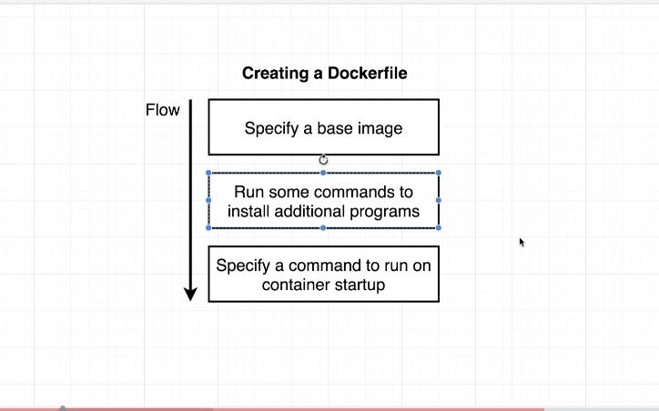
#### Creating An Image:

#### Creating an Image Anology:

#### Rubilds Caching
- Docker caches the build a cash from the latest build, as long as you do not change the order of the docker commands
 in your docker file, it would run the build from its cache and that makes docker very performant.
#### Naming Convention of Builds

- community images do not follow this convention.
##### Image Tagging
``docker build -t armangurkan/redis:latest . //-t for tag and "." for path``

##### How to Create an Image Manually instead of Using A Dockerfile:
###### Example: Manually Creating the Redis Image in the terminal
1. ``docker run -it alpine sh //docker istance is ran for alpine``
2. ``apk add --update redis //inside alpine shell command to download redis``
3. manually exit from alpine execution.
4. get the id of the alpine container by ``docker ps``
5. ``docker commit -c 'CMD ["redis-server"]' {#IdofAlpineContainer} //-c flag is for default command and after the
 flag the command is defined``
6. get the id of the new redis-server docker id ``docker run -it <#IdofRedisDocker>``  
This example shows the same functionality of dockerfile of this:
```
/*Dockerfile*/
FROM alpine  
RUN apk add --update redis
CMD ['redis-server']
```

#### Creating Containers from Your Own Projects


_** First ./ is for the current directory PATH, the second ./ is the container PATH**_
1. Express mini project created under [simpleweb](./simpleweb).
2. Dockerfile created.
    ```
    FROM node:alpine
    WORKDIR /usr/app
    COPY ./package.json ./
    RUN npm install
    COPY ./ ./
    CMD ["npm", "start"] #make sure to use double quotes
    ```
3. ``Docker build .`` the image is built
4. ``Docker build -t armangurkan/simpleweb .`` latest is appended if not entered. rebuild
5. ``Docker run armangurkan/simpleweb``
6. Port mapping is made within the run command
    
    ``docker run -p 8080:8080 armangurkan/simpleweb //two ports do not have to be identical``

###Running Multiple Docker Containers
####Docker Compose Commands
- `docker-compose up -d` d flag is for detach.
- `docker-compose down` stops all the running containers.
- Also docker-compose.yml file should be constructed, pls [visit docker-compose.yml](visits/docker-compose.yml)
####Docker docker-compose.yml Configuration:
- Server names, ports, images, if no images build paths, and restart policies etc. can be defined.
#####Restart Policies:

#####Container Status Check:
- `docker-compose ps` same thing as `docker ps`
    - major difference is `docker-compose ps` has to be ran on the same directory as the docker-compose.yml file
    , `docker ps` does not.
###Deploying to Production
It actually requires a workflow as a best practice:
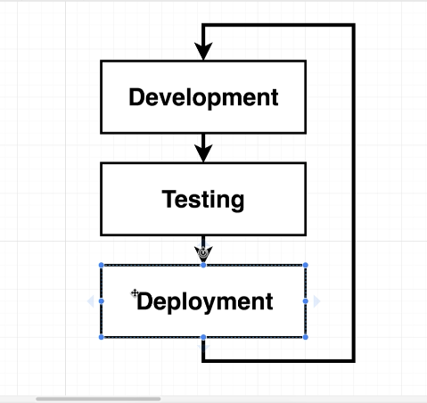
####Setting Up Dockerfiles:
- We should have two Dockerfiles, one for development and one for production.
    - Dockerfile.dev
        ````
      FROM node:alpine
      WORKDIR '/app'
      COPY ./package.json ./
      RUN npm install
      COPY ./ ./
      CMD ["npm", "run", "start"]
      ````
      - To run this command and specify that our dev environment Dockerfile is Dockerfile.dev we run this following
       command:
       ``docker build -f Dockerfile.dev .``
       - You have to delete your node modules directory in the local environment because those dependencies will be
        placed in the docker container where you are going to test your code.

    - [Dockerfile (production Docker file)](#creating-a-production-container)

####HotStartReload on Docker Containers
- After `Docker run` command we bind the local files to the container with `-v` flag and create references to the
 directories in the container to the directories in the local machine.  `-v` flag stands for Docker Volumes.
  - Docker volumes are kind of file system entities that mirror local files.
  - The docker cli command and docker-compose file config does the same job for hot restart:
  
  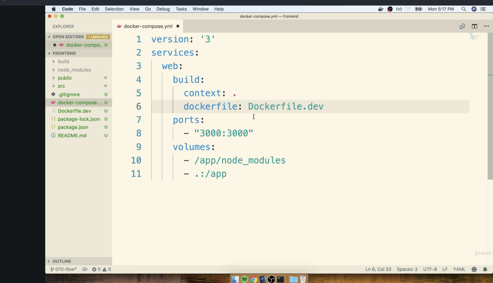

####Running Tests On Docker Container
- tests can be run via the command declared in the package.json if it is a react project for example.
    - For example
    - After running ``docker-compose up -d``
    - We can run ``docker exec -it <container-tag-name> npm run test``

### Creating a Production Container
- The production environment does not include our Dev Server.
- The production environment requires another production server (ex: nginx);
- We will have to create another Dockerfile for our build we take for the production environment.
    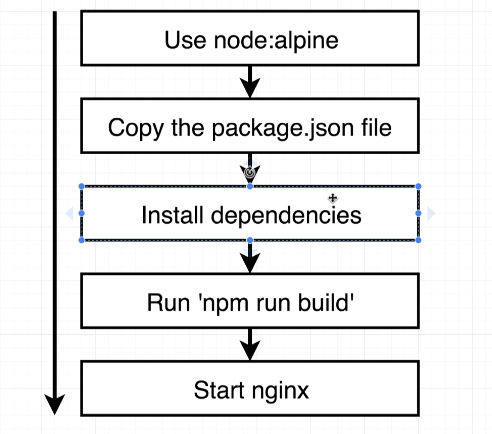

- The containerization of the production version is going to have 2 phases,
    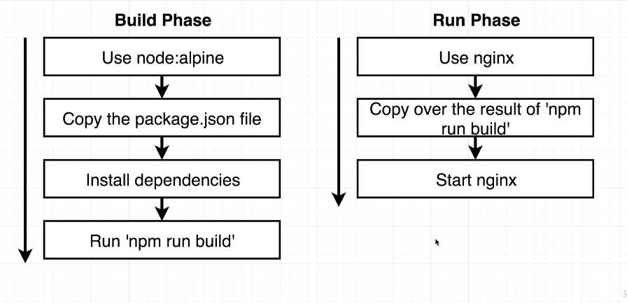
    - The build phase:
        - This is where all the dependencies are downloaded and bundled by npm run build command.
    - The run phase:
        - The run phase takes the output of the build phase as a parameter by copying it, and all the other memory
         created in the execution context of the build command is going to be deleted as that execution context closes.
    - The Dockerfile :
        ````
        # as builder command indicates that this is going to be the build phase
        FROM node:alpine as builder
        WORKDIR '/app'
        COPY ./package.json ./
        RUN npm install
        COPY ./ ./
        RUN ["npm", "run", "build"]
      
        # another from statement indicates the new phase 
        FROM nginx
        # for actual server to start receiving 80
        EXPOSE 80
        COPY --from=builder /app/build /usr/share/nginx/html
        # we don't have to have CMD statement as a return statement since the nginx image created has a self starter
        # process
        ````
    - `docker build .` builds it.
    - The next command to start the prod container would be `docker run -p 8080:80 <image_tag_name or image_id>` the
     reason we route it port 80 is that 80 is the default http port on the servers.

##Deployment
###Continuous Integration with Travis
- Travis workflow:
    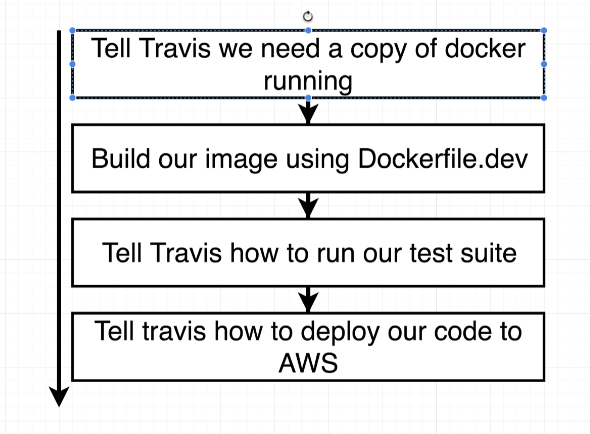

    - The reason we use docker file to use Dockerfile.dev is the fact that Travis is going to run the test suit and
     test suit is going to be testing the un-built and bundled version of the code, the reason for that is after
      bundling the variable decelerations and other part of the code may be changed for the compression effectiveness.
    - The travis directives are going to be defined in the `.travis.yml` file.  That file would look like:
    ```
  #all the travis commands would require super user permissions to be executed.  
  sudo: required 
    services:
          # declare docker usage
        - docker 
    before_install:
          # the tagname defined after -t can be anyting best practice is to name it dockerusername/repoName
        - docker build -t armangurkan1/myProject -f Dockerfile.dev .
    script:
      - docker run -e CI=true armangurkan1/myProject npm run test
    deploy:
        edge: true
        # already defined in Travis CI
        provider: elasticbeanstalk
        region: "us-west-2"
        app: "myProject"
        env: "MyProject-env"
        #when you get elasticbeanstalk you get S3 bucket automatically, find it
        bucket_name: "elasticbeanstalk-us-west-2-93483498439"
        bucket_path: "myProject"
        on:
            branch: master
        access_key_id: $AWS_ACCESS_KEY
        secret_access_key:
            secure: "$AWS_SECRET_KEY"
    ```


###Deploying to AWS
- Host as AWS
    - Has a load balancer built in.
    - If the traffic increases, the elastic beanstalk will replicate our traffic.
    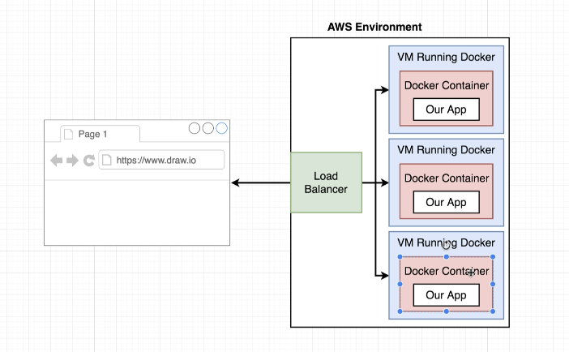
- The easiest way to start is Elastic Beanstalk for single containers.
    - Base configuration is going to Docker.
- User should be created for each program to define credentials.  Travis is going to be the user.
    - Select Programmatic access only.
    - For policies we are going to select one of the defined policies
    - We can select full access for elasticbeanstalk
    - Get access keys and access secret.
    - Go to TravisCI and create envSecret
        - A key for aws_access_key
        - A secret ofr aws_access_secret.


access_key_id: $AWS_ACCESS_KEY  
secret_access_key: $AWS_SECRET_KEY

## Deploying Multiple Containers
This is the app structure of the app to be created:
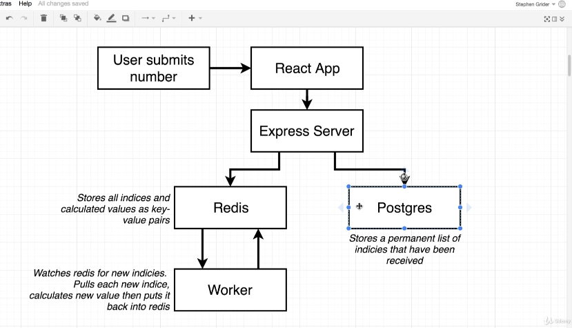

### Creating Dockerfile.dev Files for Each Service
- Unless we are using nodemon to hsr we have to run npm run start, in the Dockerfile.dev, or npm run dev, it is
 because of the simple fact that 'dev' is the script we mapped in the package.json file.
- The containers know how that they should be in connection via the way we set up our docker-compose.yml file.  The
 docker-compose.yml file will be in the root directory of the project.
  - You also have to require their node agents as npm packages to handle the communication between these different
   containers.  Just as if we are requiring for example 'mongoose' in an express app; **but we don't make a
   connection to it** as we do in Mongo Atlas, since it is not a cloud service and connection is handled by **Docker
   Server**.  Please remember that Docker is an ecosystem, not a single piece of software.  For details please visit
   complexApp directory.
### Deployment of MultiContainer Projects
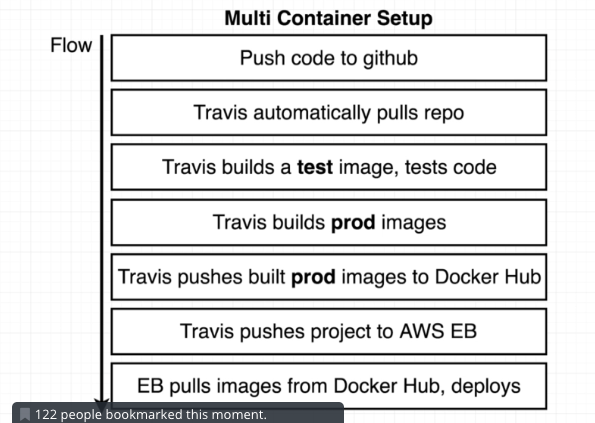

https://docs.aws.amazon.com/AmazonECS/latest/developerguide/task_definition_parameters.html#container_definitions
- To connect different services within AWS, you have to do it in security group settings in AWS menu and enable any
 request to be received within my VPC (virtual private cloud).  It can be too but it can't be as a different
  container in elastic beanstalk.
- Storage services are excluded from the main VPC instance
    - Each storage service should served from either RDS or Cache services within AWS.
# KUBERNETES
- Pods run containers
- Services are in charge of networking
- ApiVersion in the yaml file dictates what kind of object you want to create in kubernetes cluster
    - Those objects can be:
        - Pods
        - Services
        -  Event etc...
        - Nodes are VMs
### Kubernetes Hierarcy
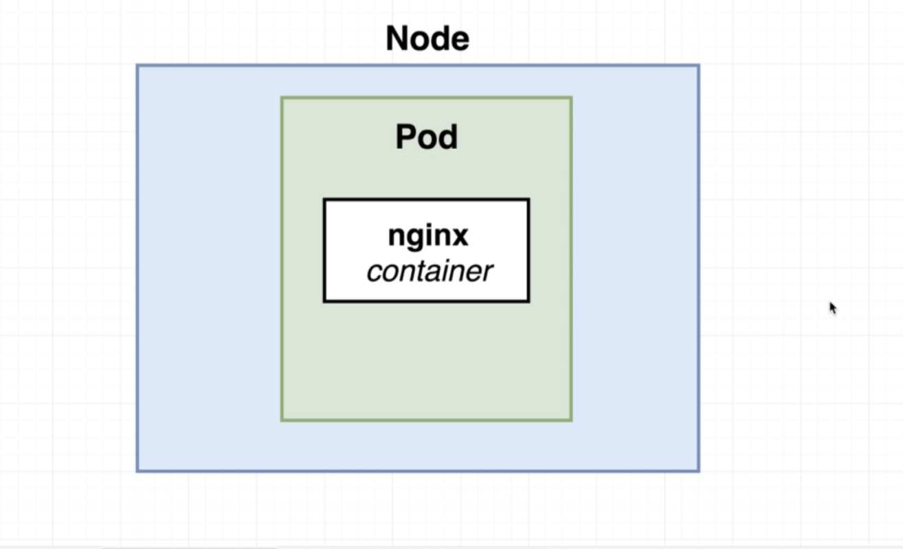
- We would only use a pod with multiple containers if the containers functionality is very very tightly coupled
  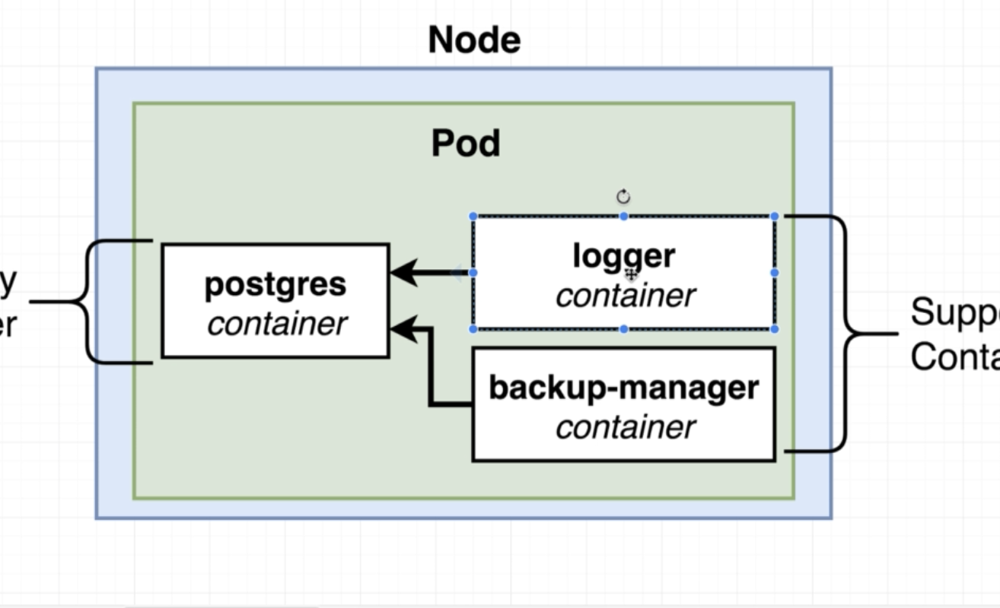
- Relationship between pods and services are as follows: 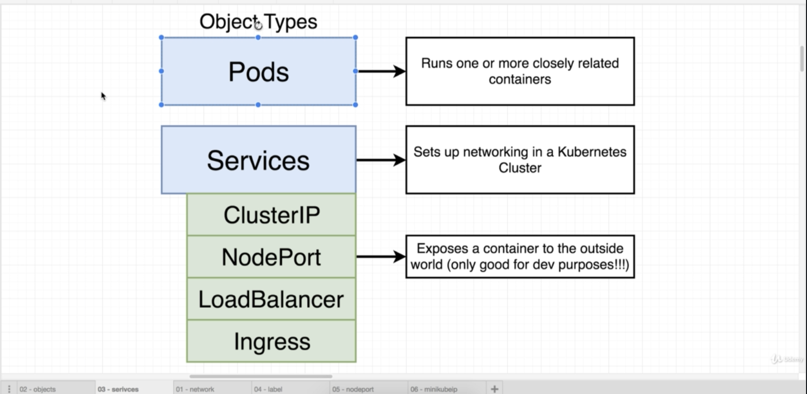
- Nodeport service functionality is as follows (a communication layer): 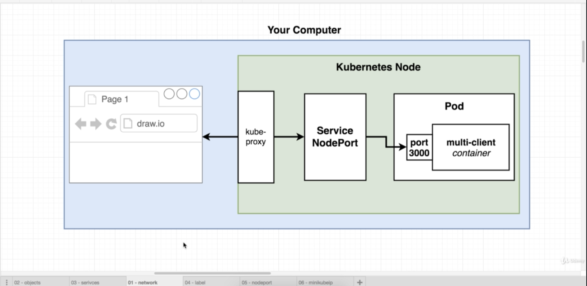
  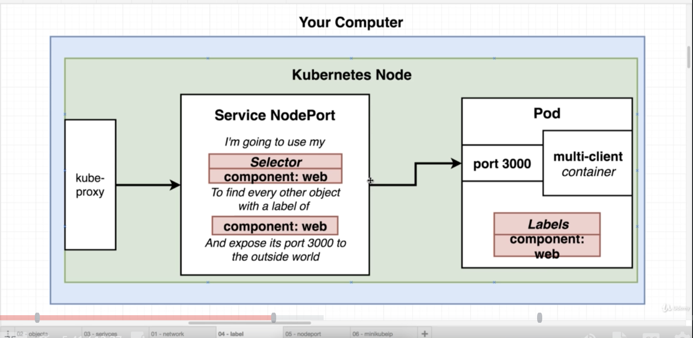
- Services and Pods do communicate with the decleration made in the config files, by label <=> selector keys.
- Port mapping diagram is as follows: 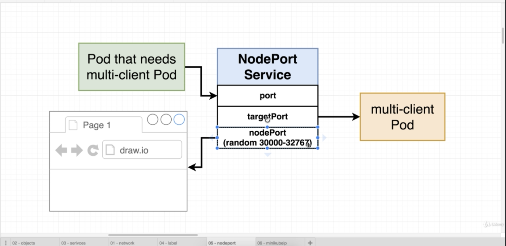
### Connecting Running Containers
- We use `kubectl apply -f <filename>` to create pods.
- We use `kubectl get pods` for listing them.
### Entire Deployment Flow for Kubernetes
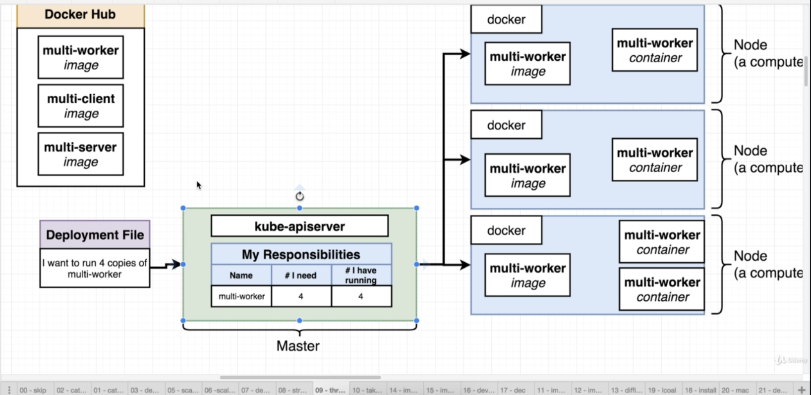
- Deployment files are the yaml files to set Pods and other Service objects.
- Each node will get the multi-worker containers from Docker Hub.
    - It takes an image per Node.
    - And it initializes four containers, as directed in deployment files out of those images.
- If you kill one container, since it was directed to run 4 containers, it will automatically restart another one, to match 4.
- `kubectl` only reaches the master.
- Key takeaways: 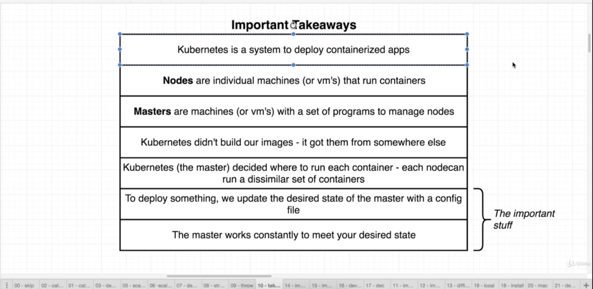
- Kubernetes deployment strategies: 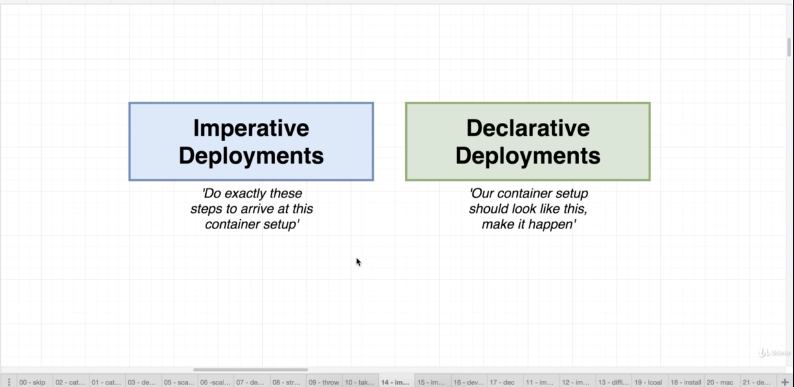
- Imperative Deployment Example (manually running the commands and structure kubernetes): 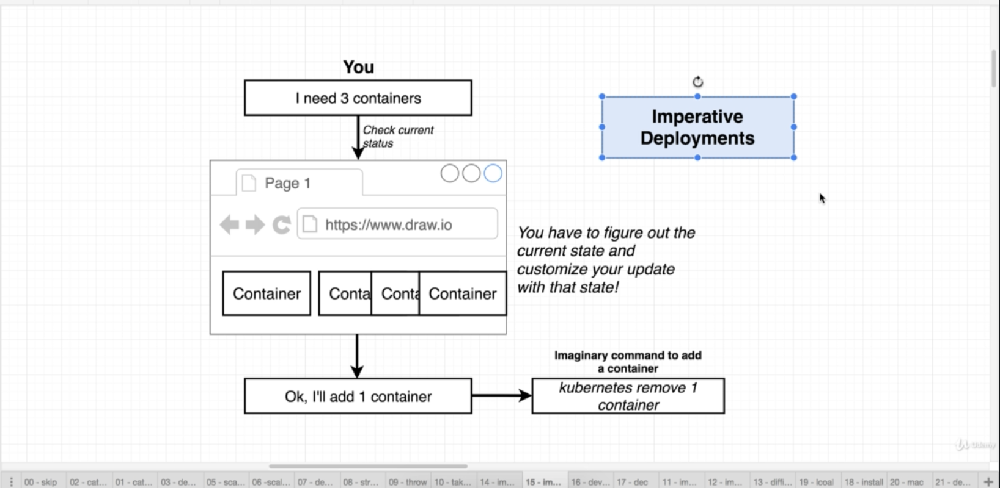
- Declerative Deployment Example (make kubernetes master maintain the structure by the yaml files given): 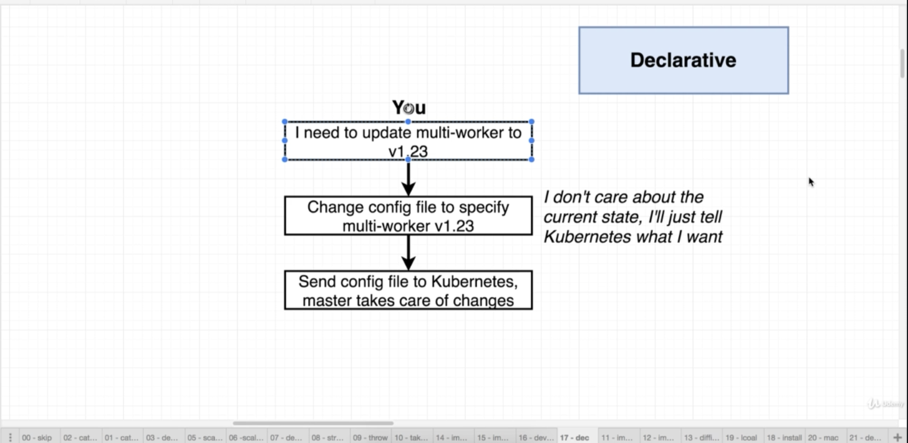
##### Comparison Declarative Imperative
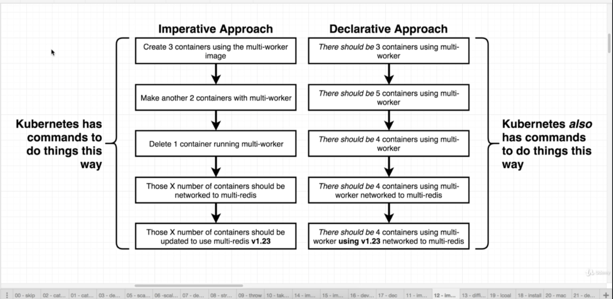

## Maintaining a Kubernetes Environment
### Updating Existing Objects
- If the **pod name** and **kind** are the same for a pod, updating a config file and feeding it to the master updates the pod rather than making a new one 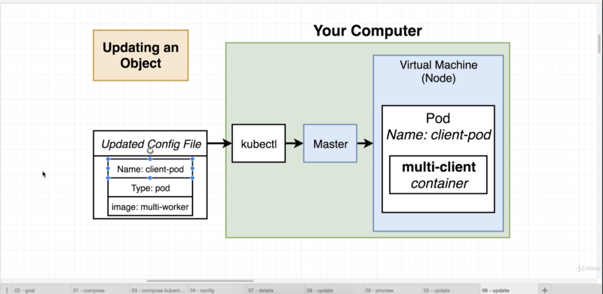
- If the name is new it will create a new pod.
- If the image name is changed form multi-client to multi-worker in [client-pod.yaml](./kubernetes/client-pod.yaml).
- To get detailed information about an object we run `kubectl describe <object type> <object name>` command.
### Limitations in Config Updates
- We are only aloud to update image related information within the container while kubernetes is running. Directly besides the code in the pod which is the image.
- This is our direct mutability to a Pod Object: 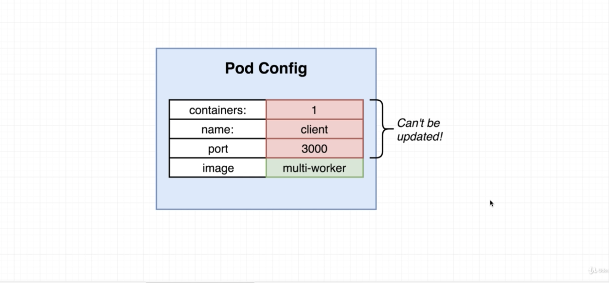
- Deployments are the objects we utilize to edit the Pod Objects.  Deployments in Kubernetes are **Objects**
> **Pods:** Runs one or more closely related containers  
> **Services:** Sets up networking in a Kubernetes Cluster  
> **Deployment:** Maintains a set of identical pods, ensuring that they have the correct config and that the right number exists
- This is the difference between Pods and Deployments: 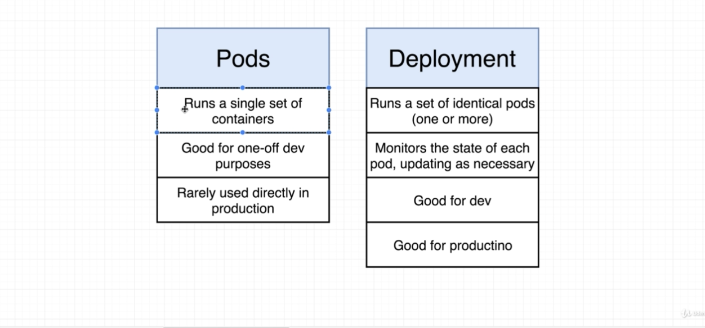
- How are **pods** and **deployments** relate to each other: 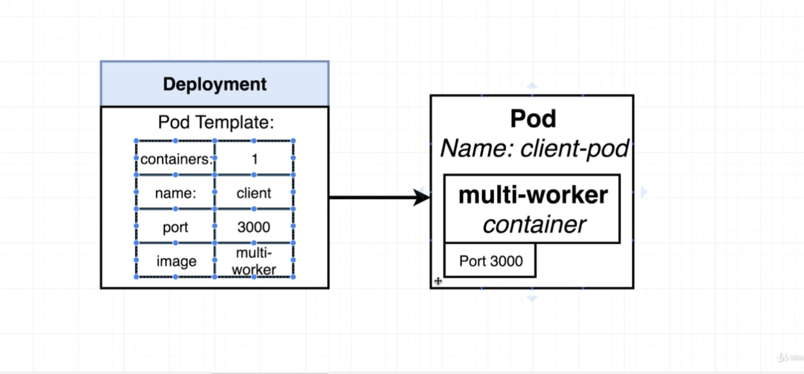
### Deployment Config Files In Detail
- 
### Applying a deployment
### Scaling and Changing Deployments
### Updating and Rebuilding Images
### Triggering Deployment Updates and Imperative Strategies
### Multiple Docker Installations and Reconfiguring Docker CLI
- 
